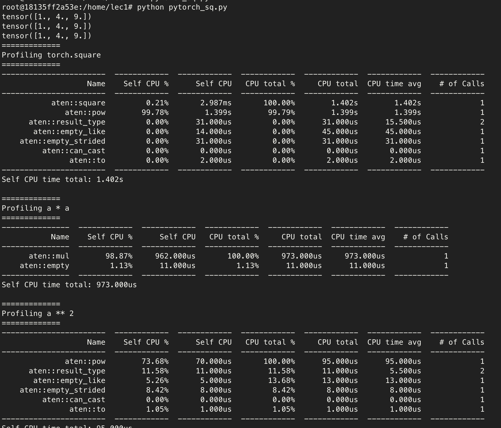

## Goal of this repo

1. integrate a CUDA kernel inside a pytorch program
2. Learn how to profile it

---

pytorch의 square연산 (a*a, a**2)을 profile해보고 두 연산을 비교해보고자 함




```

```

---
1. pytorch_squre
some of intersting
- CUDA는 비동기적 특성을 가짐. 이는 프로파일링 할 때 GPU 작업의 시간을 정확히 측정하는데 문제가 됨. 그래서 `torch.cuda.synchronize()`라는 명령어를 사용. 이 명령어는 GPU가 모든 일을 끝낼 때까지 기다리게 합니다. 이렇게 하면 GPU가 일을 다 끝낸 후에 시간을 재기 때문에, 정확한 시간을 측정할 수 있습니다.


2. PyTorch Profiler
1. Memcpy HtoD (Pageable -> device)
   - **H**ost **to** **D**evice copy
   - Pageable memory is on host but can be copied freely in out of RAM
2. 

### PyTorch Profiler
1. **기본 프로파일링 (`pt_profiler-default.py`)**:
   - 모든 반복(iteration)에 대해 프로파일링을 수행합니다.
   - 설정이 간단하며, CPU와 CUDA 활동을 모두 기록합니다.
   - 프로파일링 결과는 `trace.json` 파일로 저장됩니다.

2. **사용자 정의 스케줄 프로파일링 (`pt_profiler-custom.py`)**:
   - 사용자 정의 스케줄을 사용하여 특정 반복에서만 프로파일링을 수행합니다.
   - `wait=1, warmup=1, active=2, repeat=1` 설정을 통해 첫 번째 반복을 건너뛰고, 두 번째 반복에서 워밍업을 시작하며, 세 번째와 네 번째 반복에서 데이터를 기록합니다.
   - `trace_handler`를 통해 프로파일링 결과를 출력하거나 파일로 저장할 수 있습니다.
   - `p.step()`을 사용하여 각 반복의 시작을 프로파일러에 알립니다.

이러한 방법을 통해 PyTorch Profiler를 사용하여 모델의 성능을 세밀하게 분석하고 최적화할 수 있습니다.


### Custom C++ Extetion w/ Pytorch
- use `load_inline()`
build ninza참고. 알아서 컴파일 다 해줌. load_inline함수 쓰면.